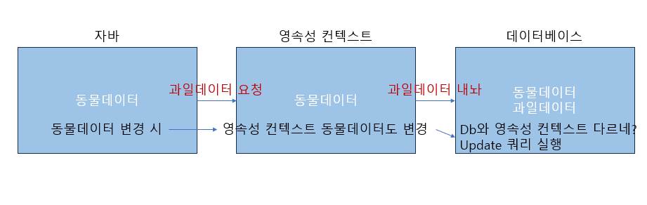
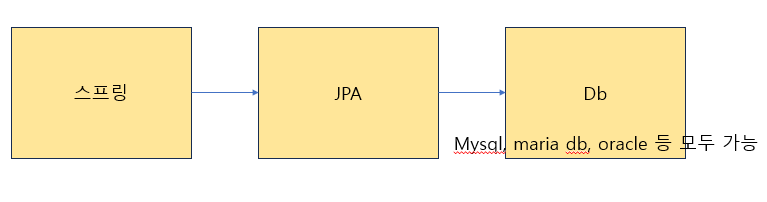

# 스프링부트 개념정리 with JPA

[강의 보러가기](https://youtu.be/XBG6CUtVCIg?si=yF1N7MYalzhut8RY)

## JPA란?
- java persistance api : 데이터를 생성한 프로그램의 실행이 종료되더라도 사라지지 않는 데이터의 특성을 의미한다. 영속성은 파일 시스템, 관계형 데이터베이스 혹은 객체 데이터베이스 등을 활용하여 구현한다. 자바 프로그래밍 언어를 사용하여 영구적인 데이터 저장이 필요할 때 사용하는 인터페이스가 JPA이다. 

- ORM (Object Relational Mapping) : 객체를 통한 매핑이기 때문에 객체를 만든 뒤, 데이터베이스 테이블을 자동 생성한다. 

- jpa는 반복적인 crud 작업을 생략하게 해줌 : 자바 프로그램이 데이터베이스에서 커넥션을 요청하고 db가 세션을 열어주면 연결이 된다. (커넥션이 됨) 그 후 쿼리를 전송할 수 있다. select, selectAll, save, delete, update 

- 영속성 컨텍스트 : 객체에 대한 모든 정보를 알고 있는 컨텍스트로 데이터베이스와 동기화된다. 

DB는 객체 저장이 불가능하지만 자바는 객체 저장이 가능해 jpa가 이런 불일치성을 해결하기 위한 방법론을 제시한다. 

    class Team {
        int id;
        String name;
        String year;
    }

    class Player {
        int id;
        String name;
        int teamId; -> Team team;
    }

- OOP 관점에서 모델링 : 위와 같이 사용하고 생성 시간 또는 수정 시간을 저장해야하는 경우 상속을 이용하면 여러 개의 테이블에서 시간 정보를 저장할 수 있게 된다. 

- 방언 처리가 용이하여 migration에 용이함 : 어떤 db든 가능함

