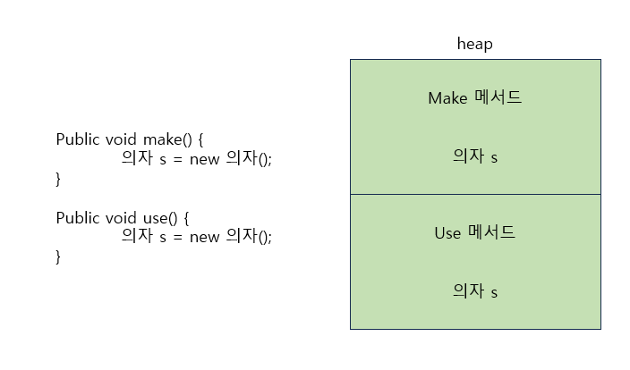
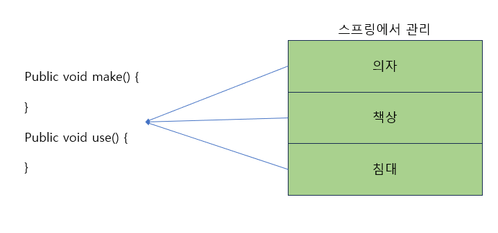
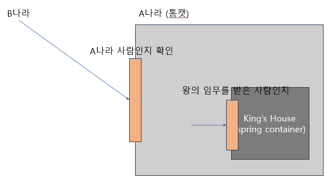
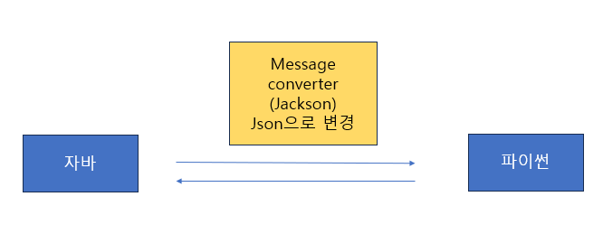

# 스프링부트 개념정리 with JPA

[강의 보러가기](https://youtu.be/XBG6CUtVCIg?si=yF1N7MYalzhut8RY)

## 스프링은?
- framework : 틀 안에서 동작한다
- open source : 소스코드가 공개되어 있다
- Ioc container (inversion of control - 제어의 역전), DI (dependency injection - 의존성 주입)

아래와 같은 경우 변수를 메서드에서 관리함으로 공유 불가

스프링에서 관리하게 되면 메서드에서 공유하는 변수를 사용할 수 있음 - 싱글톤으로 관리하여 

- filter : 필터는 문지기라고 생각하면 된다

- annotation (주석 + 힌트) : 자바의 어노테이션은 @Override처럼 사용했으면 스프링 어노테이션은 객체를 생성한다

@Componene : 클래스 메모리에 로딩 \
@Autowired : 로딩된 객체 해당 변수에 삽입 \
리플렉션 : 해당 클래스가 어떤 메서드, 어떤 필드, 어떤 어노테이션을 갖고 있는지 분석하는 기법 <- 런타임시 일어남

    @Component
    class A {

    }

    class B {
        @Autowired
        A a;
    }

- MessageConverter : 자바와 파이썬끼리 서로 본인의 object를 던지면 오류가 난다. 중간 데이터인 json으로 MessageConverter가 바꾸어줌으로써 해결했다.

- BufferedReader 와 BufferedWriter : InputStreamReader는 문자 하나를 받을 수 있어서 배열을 사용해야한다. 배열을 사용하려면 크기를 정해줘야하기 때문에 불편한다. BufferedReader는 가변 길이의 문자를 받을 수 있다. BufferedWriter 보다는 PrintWriter를 많이 쓴다. 
직접 구현할 필요없이 @ResponseBody, @RequestBody를 사용하면 Buffered로 주고 받는다. 

