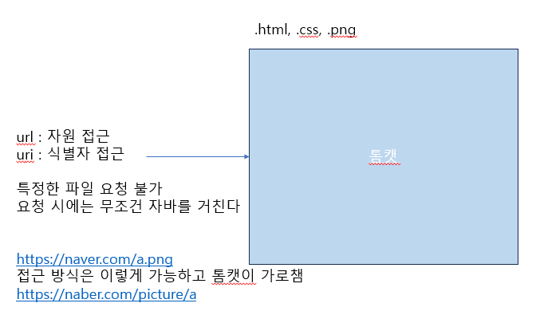

# 스프링부트 개념정리 with JPA

[강의 보러가기](https://youtu.be/XBG6CUtVCIg?si=yF1N7MYalzhut8RY)

## 스프링부트 동작원리
- 내장 톰캣

http는 socket으로 만들어졌다. (시스템 콜)\
웹 서버(아파치) : 요청 받으면 정적인 파일 리턴해줌 자기가 이해할 수 없는 파일의 요청이 들어오면 웹 어플리케이션 서버로 넘김\
웹 어플리케이션 서버(톰캣) : 동적인 파일 리턴해줌

- 서블릿 컨테이너

서블릿 컨테이너의 생명주기

